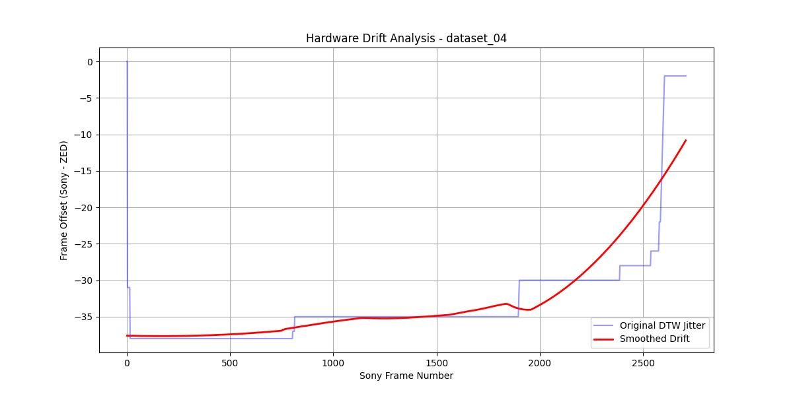
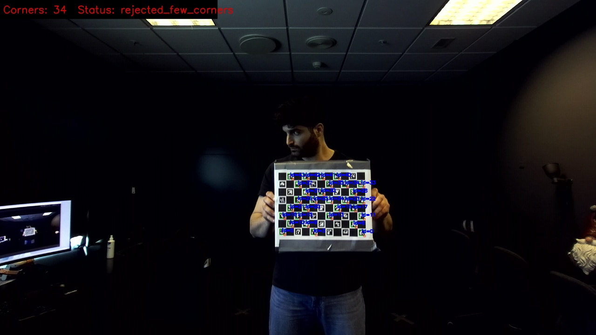
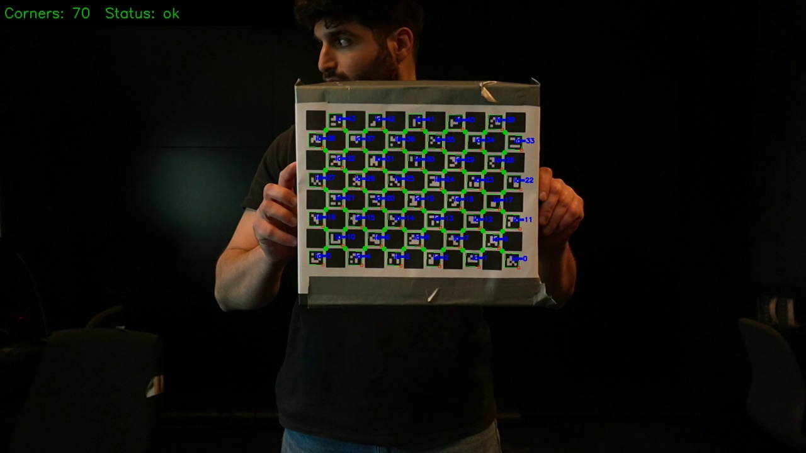
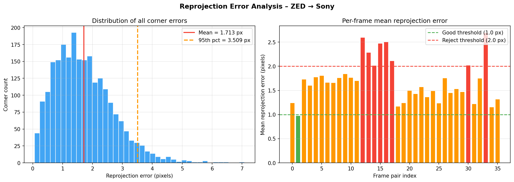
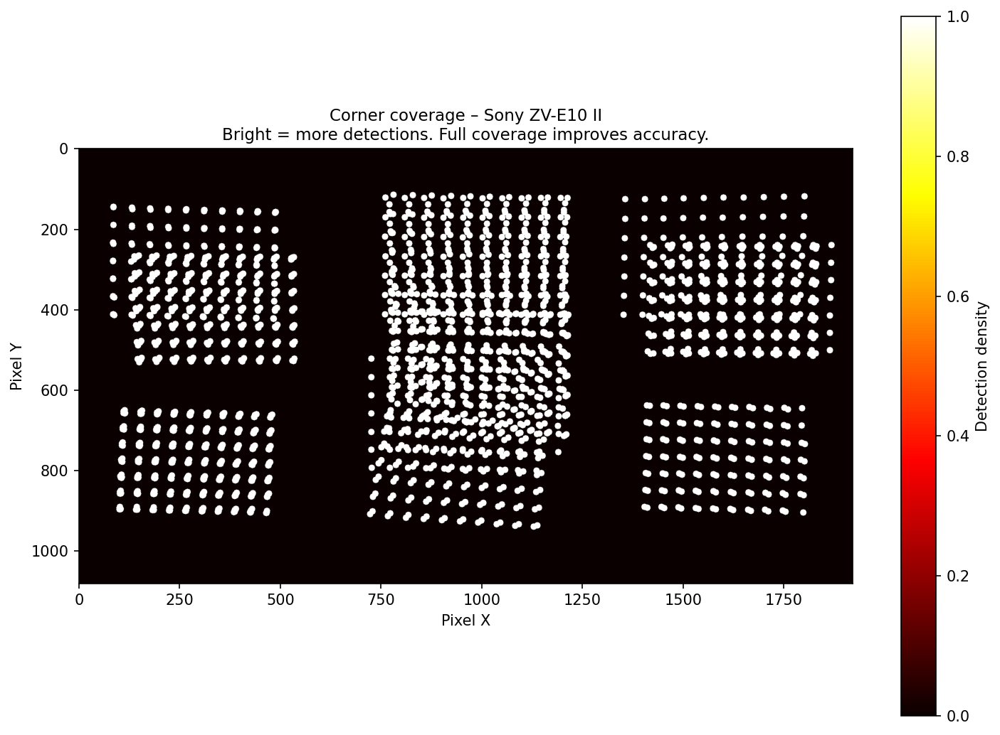
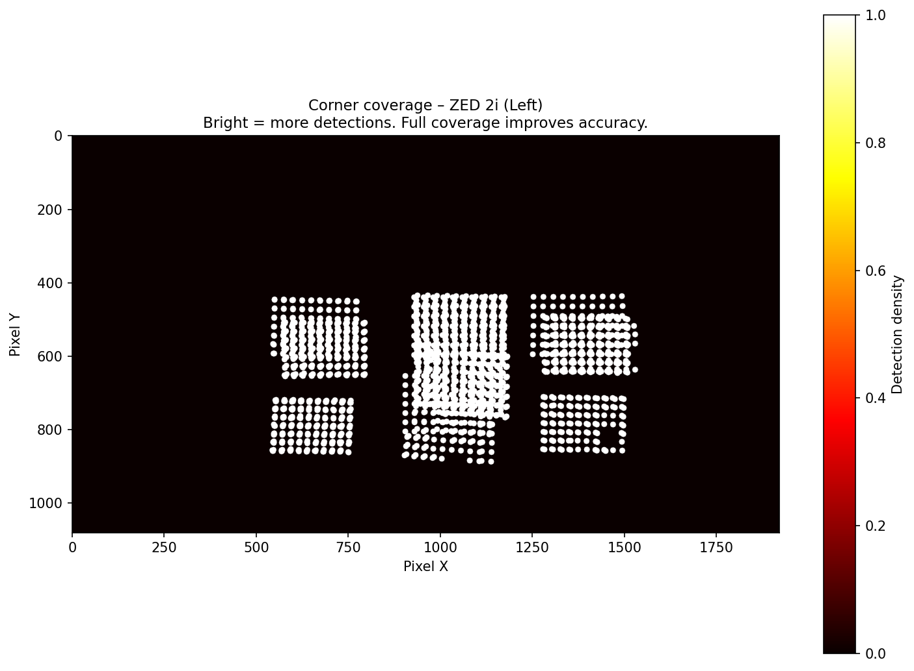
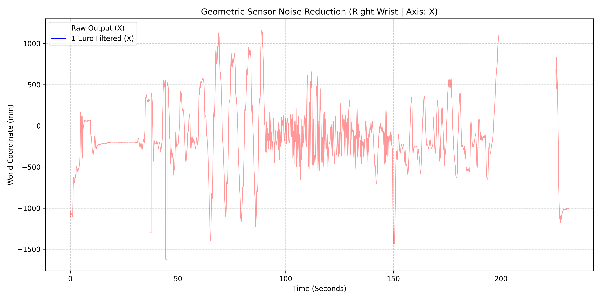
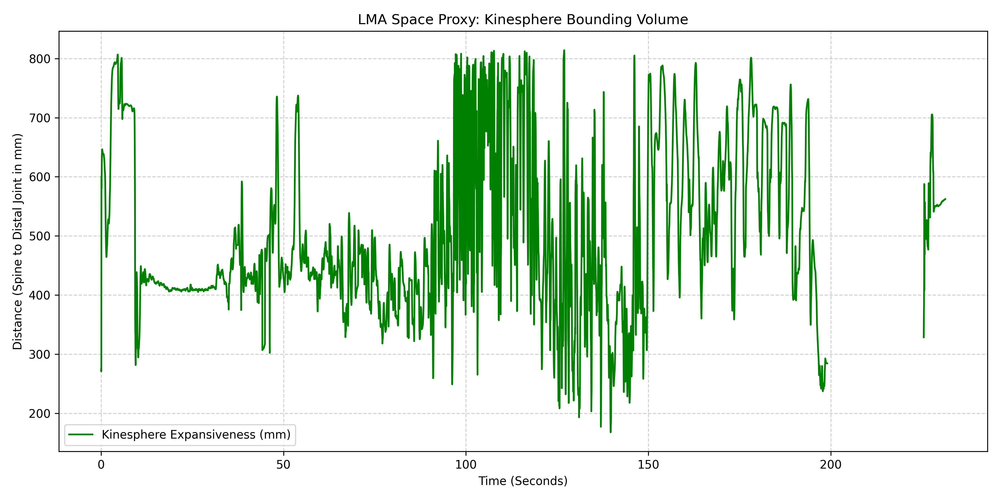

# How to Control the System using CMD

## 🚀 Getting Started

**Step 1: Build the Environment**

Clone this repository to your local machine, open your terminal in the root folder, and build the GPU-accelerated Docker container. This only needs to be done once.

```
docker compose build --no-cache
```
**Step 2: Prepare Your Raw Data**
1. Create a new folder inside data/raw/ with a descriptive name for your recording session (e.g., <dataset name>).

2. Drop your raw video files into that folder:
- One mp4 file.
- One svo file.

## ⏱️ Phase 1: Temporal Alignment
Once your raw files are in place, run the entire extraction and syncing pipeline with a single command.

Replace <dataset name> with the exact name of your folder:

```
docker compose run --rm sync ./run_temporal.sh <dataset name>
```
**What This Does:**
- Extracts the ZED video completely, then extracts the RGB video completely.

- Analyzes every frame using a ResNet50 neural network.

- Aligns the frames in time using Dynamic Time Warping (DTW).

- Smooths any hardware clock drift via Savitzky-Golay filtering.

- Copies the perfectly synced frames into data/synced/<dataset name>/.

**Temporal Drift Result — dataset_04:**



> The blue curve shows the raw frame-to-frame offset detected by DTW. The orange curve is the Savitzky-Golay smoothed mapping that is actually applied when copying synced frames. The close overlap here confirms minimal hardware clock drift in dataset_04.

**Output: `frame_mapping.json`** — raw DTW alignment mapping from Sony frame index to ZED frame index:

```json
{
  "1": 1,
  "2": 2,
  "3": 34,
  "10": 41,
  "50": 88,
  "100": 137,
  "500": 536,
  "1000": 1039
}
```

> Each key is a Sony frame number; the value is the ZED frame that was closest in visual content at that moment. Gaps or jumps (e.g., `"3": 34`) reflect hardware clock desync that DTW has corrected.

**Output: `smoothed_frame_mapping.json`** — Savitzky-Golay filtered version of the same mapping:

```json
{
  "1": 39,
  "2": 40,
  "3": 41,
  "10": 48,
  "50": 88,
  "100": 138,
  "500": 537,
  "1000": 1039
}
```

> The smoothed mapping removes high-frequency jitter from the raw DTW output. These are the ZED frame indices actually used when writing files to `data/synced/`.

---

## 📐 Phase 2: Spatial Alignment
Once the cameras are matched in time, the system calculates the optical and geometric relationship between the two cameras. This is a two-step process: curating frames, then running the calibration pipeline.

###  2.1 Record a Calibration Dataset
Before picking frames, record a dedicated calibration clip using the ChArUco board:

- Use the board printed from calib_io_charuco_200x150_8x11_15_11_DICT_4X4.pdf (A3 print, mounted flat on rigid cardboard).
- Hold the board 0.5 m to 1.2 m from both cameras simultaneously — this is critical for ZED detection.
- Move the board to cover all four corners of the frame, all four edges, and the center.
- At each position, tilt the board left, right, and toward the camera (~30° angles).
- Record for 3–4 minutes. Run Phase 1 on this recording to get synchronized frames.


###  2.2 Pick the Best Frames
Do not feed thousands of frames into the spatial calibrator. The algorithm requires a curated set of 30 to 50 perfect frame pairs with geometric diversity.
The Golden Rule: Every frame must show the ChArUco board razor-sharp with zero motion blur.
Open data/synced/<dataset>/sony_rgb/ and select frames covering these four categories:

- Edges (10 frames): Board flat and facing both cameras, positioned at the top, bottom, left, right, and four corners of the frame.
- Angles (10 frames): Board near center but heavily tilted backward, forward, left, and right (~30°).
- Depths (10 frames): Board at 0.5 m (close) and 1.0–1.2 m (medium), 5 frames each.
- Rotations (10 frames): Board flat but rotated clockwise and counter-clockwise like a steering wheel.

**The Copying Workflow:**
- Identify a good Sony frame (e.g., 00450.png) and copy it to data/picked_for_alignment/<dataset>/sony_rgb/.
- Find the exact same frame number in data/synced/<dataset>/zed_rgb/ and copy it to data/picked_for_alignment/<dataset>/zed_rgb/.
- Repeat until you have 30–50 matched pairs in both folders.

###  2.3 Run the Spatial Calibrator
Once you have your curated set of frames, run the spatial calibration pipeline:
```
docker compose run --rm sync ./run_spatial.sh <dataset name>
```
**What This Does:**

---

**[1/5] `inspect_detections.py`** — Runs ChArUco detection on every frame. It filters the frames based on a detection threshold of 45 corners. It generate the following output directories:
- data/inspected/<dataset>/sony_rgb/ => Contains the Sony frames that passed the detection thershold.
- data/inspected/<dataset>/zed_rgb/ => Contains the ZED frames that passed the detection thershold.
- data/plots/<dataset>/spatial/detection_check/ => saves annotated images with visualization of the detected corners and a label of the number of corners detected of all frames.

**Example annotated detection frame — dataset_04:**



> The detection script is responsible for detecting and counting the ChArUco corners on the board in each frame. The overlay label shows the total corner count. Only frames exceeding 45 corners advance to calibration.

**Output: `detection_summary.json`** — per-frame detection result for every input frame:

```json
{
  "sony": [
    {
      "file": "00001.png",
      "status": "rejected_no_markers",
      "n_markers": 0,
      "n_corners": 0
    },
    {
      "file": "00014.png",
      "status": "ok",
      "n_markers": 36,
      "n_corners": 47
    },
    {
      "file": "00084.png",
      "status": "ok",
      "n_markers": 44,
      "n_corners": 70
    }
  ],
  "zed": [
    {
      "file": "02139.png",
      "status": "rejected_few_markers",
      "n_markers": 31,
      "n_corners": 34
    },
    {
      "file": "00014.png",
      "status": "ok",
      "n_markers": 31,
      "n_corners": 52
    }
  ]
}
```

> `status` is one of `"ok"` (passes threshold), `"rejected_few_corners"` (board visible but below 45 corners), or `"rejected_no_markers"` (No markers found at all).
---

**[2/5] `stereo_calibrate.py`** — Runs individual camera calibration on each camera followed by full stereo calibration. Outputs data/json_output/<dataset>/spatial_calibration.json containing:

- Intrinsic camera matrices (K) and distortion coefficients (D) for both cameras.
- Extrinsic rotation matrix (R) and translation vector (T) from ZED to Sony coordinate space.
- Ready-to-use UE5 LensOffset values in centimetres.

**Output: `spatial_calibration.json`** —  Shows the full calibration result in this format:

```json
{
  "meta": {
    "dataset": "dataset_04",
    "valid_pairs_used": 36,
    "timestamp": "2026-05-05T14:27:43"
  },
  "sony_camera": {
    "camera_matrix": [
      [1949.24,    0.0,  908.71],
      [   0.0, 1944.20, 577.85],
      [   0.0,    0.0,    1.0 ]
    ],
    "distortion_coeffs": [[-0.1058, 1.4287, 0.0021, -0.0087, -2.6126]]
  },
  "zed_camera": {
    "camera_matrix": [
      [1110.11,    0.0,  973.99],
      [   0.0, 1110.59, 597.22],
      [   0.0,    0.0,    1.0 ]
    ],
    "distortion_coeffs": [[0.0804, -0.0177, 0.0188, 0.0001, 0.3439]]
  },
  "extrinsics": {
    "rotation_degrees": [-0.33, 1.94, 0.35],
    "translation_cm":   [-7.71, -10.36, -4.11],
    "stereo_rms_px": 0.807
  },
  "ue5_offset": {
    "X_cm": -7.706,
    "Y_cm": -10.357,
    "Z_cm": -4.107
  }
}
```

> `camera_matrix` is the 3×3 intrinsic matrix K: `[fx, 0, cx; 0, fy, cy; 0, 0, 1]`. `distortion_coeffs` follow the OpenCV radial-tangential model `[k1, k2, p1, p2, k3]`. `rotation_degrees` are the Rodrigues rotation converted to Euler angles. `ue5_offset` is a direct copy of `translation_cm` ready to paste into the UE5 Details panel.

---

**[3/5] `pick_frames.py`** — An automation script that autmomates the selection process based on 2 criteria:
- Number of corners detected (threshold of 45).
- Spatial diversity (ensures a good spread of board positions and angles across the frame).
- Applies Motion filter to only include frame coupling where the movment energy is very low, ensuring the board is perfectly still and sharp in both cameras.

The script produces the following output directories:
- data/picked_for_alignment/<dataset_name>//sony_rgb/ => Contains the Sony frames that passed the detection thershold and motion filter.
- data/picked_for_alignment/<dataset_name>/zed_rgb/ => Contains the ZED frames that passed the detection thershold and motion filter.
- data/plots/<dataset_name>/spatial/picked_for_alignment/ => saves annotated images with visualization of the detected corners and a label of the number of corners detected of all frames that passed the detection thershold and motion filter.

**Example auto-picked frame — dataset_04:**



> The annotation shows the corner count and confirms the board is sharp and stationary, with all 70 corners detected. This makes this frame example vaible to enter the calibration process.
---

**[4/5] `validate_calibration.py`** — Computes per-frame reprojection errors and saves analysis plots to data/plots/<dataset_name>/spatial/. The overall RMS error should be below 0.5 px for excellent calibration. RMS value under 1.8 px are considered good. Calibrations between 1,8 and 2.5 px are acceptible, and anything above 2.5 px is flagged as poor calibration that should be redone with better frames.

**Reprojection Error Analysis — dataset_04:**



> Per-frame mean reprojection error (bar chart) and the overall error distribution (histogram). Dataset_04 achieved a mean of **1.71 px** with no bad frames (0 frames above 2.5 px threshold) — rated **"Good"**.

**Corner Coverage Heatmaps:**

| Sony Camera | ZED Camera |
|:-----------:|:----------:|
|  |  |

> These density maps show where ChArUco corners were detected across the image plane. Good spatial coverage (corners distributed across the full frame area) is essential for a well-conditioned calibration. Dataset_04 shows strong coverage across the full sensor area for both cameras.

**Output: `validation_report.json`** — summary statistics and per-frame breakdown:

```json
{
  "dataset": "dataset_04",
  "n_frames_validated": 36,
  "overall_mean_px": 1.713,
  "overall_std_px": 0.981,
  "percentile_95_px": 3.509,
  "frames_good": 14,
  "frames_warn": 19,
  "frames_bad": 0,
  "bad_frame_names": [],
  "assessment": "Good",
  "per_frame": [
    {
      "frame_pair": ["00084.png", "00084.png"],
      "n_corners": 70,
      "mean_error_px": 1.245,
      "max_error_px": 3.110,
      "std_error_px": 0.718,
      "errors_px": [0.404, 0.382, 0.406, 0.376, "..."]
    }
  ]
}
```

> `frames_good` = mean error < 1.0 px. `frames_warn` = between 1.0 and 2.5 px. `frames_bad` = above 2.5 px (triggers a redo warning). `errors_px` lists the per-corner reprojection error for every detected corner in that frame pair.

---

**[5/5] `apply_calibration.py`** — Reads the calibration JSON and prints the final UE5 offset values directly to the terminal.

The terminal output mirrors the `ue5_offset` block from `spatial_calibration.json`:

```json
{
  "ue5_offset": {
    "X_cm": -7.706,
    "Y_cm": -10.357,
    "Z_cm": -4.107
  }
}
```

> Tthese values can beplugged directly into the UE5 CineCamera actor so the FOV and viewing output exactly matches the physical camera. No unit conversion needed — the system outputs centimetres, which is the native unit UE5 expects for this field.

### 2.4 Diagnostic Tools
To validate the calibration, a custom validation pipeline is made to evaluate the calibration quality and point out any potentail issues.
The pipleine can be run with the following command:
```
docker compose run --rm align python3 spatial_alignment/diagnose_detection.py --dataset <dataset name>
```
This tests all supported ArUco dictionary variants and board size combinations and identifies the working configuration.

## 🦴 Phase 3: Kinematic Extraction and Filtering
With the cameras spatially calibrated, Phase 3 extracts the performer's 3D skeletal data from the ZED SVO recording, denoises each joint trajectory using the 1 Euro Filter, and computes the LMA Expansiveness metric as a proxy for the performer's use of kinesphere space.

Run the full pipeline with a single command:

```
docker compose run --rm filter ./run_filtering.sh <dataset name>
```

To target a specific joint and axis for the noise-reduction plot:

```
docker compose run --rm filter ./run_filtering.sh <dataset name> --joint <joint_name> --axis <x|y|z>
```

Default: `--joint right_wrist --axis x`. Any of the 38 BODY_38 joint names are valid (e.g., `pelvis`, `left_wrist`, `right_knee`, `spine_2`).

**What This Does:**

---

**[1/2] `extract_kinematics.py`** — Opens the raw `.svo` file from `data/raw/<dataset>/` using the ZED SDK and runs the `HUMAN_BODY_ACCURATE` body tracking model in `BODY_38` format. For every frame where the pelvis root joint is confidently tracked, it writes one row of 3D world-space coordinates for all 38 joints to a CSV file.

The 38 joints extracted (BODY_38 format):

> `pelvis` · `spine_1` · `spine_2` · `spine_3` · `neck` · `nose` · `left_eye` · `right_eye` · `left_ear` · `right_ear` · `left_clavicle` · `right_clavicle` · `left_shoulder` · `right_shoulder` · `left_elbow` · `right_elbow` · `left_wrist` · `right_wrist` · `left_hip` · `right_hip` · `left_knee` · `right_knee` · `left_ankle` · `right_ankle` · `left_big_toe` · `right_big_toe` · `left_small_toe` · `right_small_toe` · `left_heel` · `right_heel` · `left_hand_thumb_4` · `right_hand_thumb_4` · `left_hand_index_1` · `right_hand_index_1` · `left_hand_middle_4` · `right_hand_middle_4` · `left_hand_pinky_1` · `right_hand_pinky_1`

**Output: `raw_skeleton_data.csv`** — 115-column flat table (1 frame index + 38 joints × 3 axes). All coordinates are in **millimetres** in ZED world space:

```
frame_idx, pelvis_x, pelvis_y, pelvis_z, spine_1_x, spine_1_y, spine_1_z, ..., right_hand_pinky_1_x, right_hand_pinky_1_y, right_hand_pinky_1_z
0,  -486.42,  375.43, 1715.04,  -569.30,  329.02, 1699.13, ...,  312.45, -88.12, 2198.30
1,  -491.15,  379.24, 1714.81,  -601.54,  348.78, 1781.67, ...,  314.10, -87.55, 2201.77
2,  -493.80,  381.10, 1715.22,  -605.21,  351.33, 1784.02, ...,  315.02, -86.91, 2203.44
```

> Rows are only written for frames where the pelvis joint is not `NaN` — frames where the performer is fully out of frame are silently skipped. The `frame_idx` column matches the original ZED SVO frame number, not a sequential row counter.

---

**[2/2] `validate_kinematics.py`** — Reads the raw CSV, applies the **1 Euro Filter** to denoise the target joint, computes the **LMA Kinesphere Expansiveness** metric frame-by-frame, and saves two diagnostic plots.

**1 Euro Filter parameters (hardcoded):**

```json
{
  "fps": 30,
  "min_cutoff": 1.0,
  "beta": 0.05,
  "d_cutoff": 1.0
}
```

> `min_cutoff` (Hz) controls jitter suppression at rest — lower values smooth more aggressively. `beta` controls lag reduction during fast movement — higher values reduce lag at the cost of some noise passthrough. The current values (`min_cutoff=1.0`, `beta=0.05`) are tuned for ZED 2i body tracking at 30 fps.

**Plot 1 — 1 Euro Noise Reduction (`1Euro_noise_reduction_{joint}_{axis}.png`):**

Overlays the raw (red) and filtered (blue) coordinate signal for the selected joint and axis over time.



> The red signal is the raw ZED SDK output; the blue signal is the 1 Euro filtered output. The filter attenuates high-frequency jitter at rest while preserving sharp transients during ballistic limb movements. This comparison is the primary diagnostic for tuning `min_cutoff` and `beta`.

**Plot 2 — LMA Expansiveness (`lma_expansiveness.png`):**

Plots the maximum reach distance from `spine_2` to either wrist over time — a proxy for the performer's use of kinesphere space (Laban Movement Analysis).



> The y-axis is the Euclidean distance in mm from `spine_2` to the furthest wrist. Peaks correspond to large gestural reaches; valleys indicate arms held close to the body. This metric is computed from raw (unfiltered) wrist positions to preserve the full dynamic range of the gesture signal.
The LMA Expansiveness metric and the filtered joint trajectories produced in Phase 3 serve as the analytical foundation for the Embodied Interaction layer described in Phase 4. 
The 1 Euro Filter parameters validated here (`min_cutoff=1.0`, `beta=0.05`) are the same parameters applied at runtime inside the UE5 C++ component to denoise the live ZED skeletal stream before descriptor computation.

---

## 🕺 Phase 4: Embodied Interaction — Kinematic AR

Phase 4 extends the compositing pipeline into a live action-perception 
coupling system. The performer's movement qualities — derived from the 
filtered 38-joint skeletal stream — drive the behaviour of foreground CG 
elements rendered in Unreal Engine 5. The system is grounded in Laban 
Movement Analysis (LMA) and computes four continuous descriptors from the 
live ZED body tracking data at 30 Hz.

The Embodied Interaction layer operates in two switchable modes with no 
level reload required:

- **Compositing Mode** — CG elements behave as depth-occluded compositing 
  objects only. The stencil-based occlusion pipeline runs as normal. 
  No interaction logic is active.
- **Interactive Mode** — The full EI layer activates. CG elements respond 
  to the qualitative character of the performer's movement in real time.

---

### 4.1 The Four LMA Descriptors

The system computes four scalar values from the live ZED BODY_38 skeletal 
stream each tick. Each corresponds to one of Laban's four Effort factors.

| Descriptor | LMA Factor | Computation | Output Target |
|---|---|---|---|
| **Effort** | Time: Sudden ↔ Sustained | Weighted RMS velocity of key limb joints | Niagara: particle emission rate and velocity |
| **Expansiveness** | Space: Expanded ↔ Contracted | Maximum wrist-to-spine_2 distance | MPC: WPO surface deformation frequency + RadialForce radius |
| **Weight** | Weight: Strong ↔ Light | Acceleration magnitude across key joints | MPC: WPO surface bend amplitude |
| **Flow** | Flow: Free ↔ Bound | Rolling standard deviation of velocity delta | Niagara: attractor strength + MPC: surface noise scale |

The force field distributes along the direction vector from `spine_2` to the 
furthest wrist, not omnidirectionally. This means a forward arm thrust pushes 
the CG grid forward; a lateral sweep pushes it laterally. The magnitude is 
governed by the quality descriptors. The direction is read from body 
orientation because, in LMA terms, directional intent is itself a spatial 
quality — not a positional fact separate from it.

---

### 4.2 The Eight LMA Action Drives

The four descriptors combine to produce the eight canonical LMA Action Drives 
as continuous emergent regions rather than discrete classifications. The system 
does not classify which drive is occurring; it positions the movement 
continuously within the four-dimensional Effort space.

| Action Drive | Time | Weight | Space | Flow | CG Grid Response |
|---|---|---|---|---|---|
| **Punch / Thrust** | Sudden | Strong | Contracted | Bound | Forceful tight implosion, spike rebound |
| **Slash** | Sudden | Strong | Expanded | Free | Maximum scatter, turbulent surface, dense particles |
| **Wring** | Sustained | Strong | Expanded | Bound | Slow outward stretch with weight, wide arc bends |
| **Press** | Sustained | Strong | Contracted | Bound | Deliberate inward compression, deep smooth bends |
| **Flick** | Sudden | Light | Expanded | Free | Light scatter, brief surface flutter, fast sparse particles |
| **Dab** | Sudden | Light | Contracted | Bound | Small precise burst, minimal deformation |
| **Float** | Sustained | Light | Expanded | Free | Slow outward drift, gentle undulation, sparse particles |
| **Glide** | Sustained | Light | Contracted | Bound | Tight stable formation, smooth surfaces, calm field |

---

### 4.3 CG Element Design — Particle Grid

The demonstration scenario places the performer at the centre of a 
three-dimensional grid of physics-simulated cubic objects in the LED volume. 
The grid is permanently anchored to the performer's pelvis joint position 
in world space, keeping the body at the centre of the formation regardless 
of movement through the stage.

The grid simultaneously demonstrates all three technical pillars of the system:

- **Compositing and occlusion**: cubes in front of the performer are correctly 
  occluded by the depth comparison pipeline. Cubes behind the performer are 
  hidden behind the body. A rotating camera continuously renegotiates these 
  depth relationships in three dimensions.
- **Embodied interaction**: cube surfaces deform and scatter in response to 
  movement quality. The performer's expressive choices visibly transform the 
  virtual environment around them.
- **Perceptual legibility**: gaps between cubes keep the performer visible 
  through the grid at all times, making both the compositing and the 
  interaction readable in a single frame.

---

### 4.4 Runtime Architecture

The EI runtime is implemented in the `VP_AR_full_System_runtime` repository 
as two UE5 C++ Actor Components:

**`UKinematicDescriptorComponent`** — reads the live ZED LiveLink BODY_38 
subject every tick, applies the 1 Euro Filter to suppress geometric sensor 
noise, computes the four LMA descriptors, runs the adaptive output curve 
(dead zone + saturation sigmoid), and writes the results to 
`MPC_KinematicAR` and the Niagara component.

**`UProximityDispatchComponent`** — reads the pelvis joint position every 
tick and writes a normalised `PerformerProximity` value to the Dynamic 
Material Instance of each registered AR mesh actor. This drives a contact 
deformation WPO effect that is active in both operating modes, ensuring 
clean physical boundary behaviour at depth transitions even when the EI 
layer is off.

The Material Parameter Collection `MPC_KinematicAR` holds four scalar 
parameters written at runtime:

| Parameter | Written by | Controls |
|---|---|---|
| `ExpansivenessLevel` | `UKinematicDescriptorComponent` | WPO deformation frequency, RadialForce radius |
| `WeightLevel` | `UKinematicDescriptorComponent` | WPO surface bend amplitude |
| `FlowLevel` | `UKinematicDescriptorComponent` | WPO surface noise scale |
| `SystemMode` | `UProximityDispatchComponent::SetSystemMode()` | Gates WPO channels 2 and 3 in all AR materials |

The Niagara system `NS_KinematicAR` exposes two User Parameters:

| Parameter | Controls |
|---|---|
| `User.EffortLevel` | Particle emission rate and initial velocity |
| `User.FlowLevel` | Mutual attractor strength between grid cubes |

---

### 4.5 Smoothing Models as Artistic Parameters

The adaptive smoothing system from Phase 3 (1 Euro Filter) handles geometric 
sensor noise suppression on the raw joint stream. On top of this, the output 
descriptors pass through a calibrated adaptive interpolation stage before 
reaching the visual outputs. Three mapping models are available, selectable 
at runtime via the `EAdaptiveModel` enum on the component.

The choice of model is not purely technical — it defines the expressive 
relationship between the performer and the AR environment, and corresponds 
to distinct movement traditions:

| Model | LMA Quality | Dance Tradition |
|---|---|---|
| **Linear** | Sustained + Bound | Classical Ballet, Cecchetti, RAD, Neoclassical |
| **Sigmoid** | Transitional + Free | Contemporary, Limón, Contact Improvisation, Cunningham |
| **Piecewise** | Sudden + Strong, Bound between states | Hip-Hop, Flamenco, Butoh, Breaking |

---

## 🔗 Related Repositories

| Repository | Role |
|---|---|
| [`VP_AR_full_System`](https://github.com/Muhannad7794/VP_AR_full_System) | This repository. Offline pipeline: temporal alignment, spatial calibration, kinematic extraction and filtering. |
| [`VP_AR_full_System_runtime`](https://github.com/Muhannad7794/VP_AR_full_System_runtime) | UE5 C++ runtime: camera tracking, compositing, occlusion, EI descriptor components, Niagara, mode switching. |
| [`vp_baseFree_tracking`](https://github.com/Muhannad7794/vp_baseFree_tracking) | Adaptive smoothing analysis pipeline for camera tracking. Analysis and modelling of sigma-based interpolation models. |

## Output Reference

| Path | Contents |
| --- | --- |
| `data/extracted/<dataset>/sony_rgb/` | All raw Sony frames extracted from the MP4 |
| `data/extracted/<dataset>/zed_rgb/` | All raw ZED left-eye frames extracted from the SVO2 |
| `data/extracted/<dataset>/zed_depth/` | All raw 16-bit ZED depth maps |
| `data/json_output/<dataset>/frame_mapping.json` | Temporal alignment mapping based on similarity algorithm and DTW |
| `data/json_output/<dataset>/smoothed_frame_mapping.json` | Savitzky-Golay filtered mapping |
| `data/plots/<dataset>/drift_comparison.jpg` | Raw vs. smoothed temporal drift graph |
| `data/synced/<dataset>/sony_rgb/` | Temporally aligned Sony frames |
| `data/synced/<dataset>/zed_rgb/` | Temporally aligned ZED frames |
| `data/synced/<dataset>/zed_depth/` | Temporally aligned depth maps |
| `data/inspected/<dataset>/sony_rgb/` | Sony frames that passed the ChArUco detection threshold |
| `data/inspected/<dataset>/zed_rgb/` | ZED frames that passed the ChArUco detection threshold |
| `data/plots/<dataset>/spatial/detection_check/` | Annotated frames with detected corners and counts |
| `data/plots/<dataset>/spatial/picked_for_alignment/` | Annotated frames that passed both detection and motion filters |
| `data/picked_for_alignment/<dataset>/sony_rgb/` | Manually curated Sony calibration frames |
| `data/picked_for_alignment/<dataset>/zed_rgb/` | Matching manually curated ZED calibration frames |
| `data/json_output/<dataset>/spatial_calibration.json` | Intrinsics, extrinsics, and UE5 offsets |
| `data/json_output/<dataset>/detection_summary.json` | Per-frame ChArUco detection counts |
| `data/json_output/<dataset>/validation_report.json` | Per-frame reprojection error analysis |
| `data/plots/<dataset>/spatial/reprojection_error_analysis.png` | Error distribution and per-frame bar chart |
| `data/plots/<dataset>/spatial/corner_coverage_sony_rgb.png` | Sony corner detection density map |
| `data/plots/<dataset>/spatial/corner_coverage_zed_rgb.png` | ZED corner detection density map |
| `data/plots/<dataset>/spatial/detection_check/` | Annotated frames from inspect_detections.py |
| `data/plots/<dataset>/spatial/diagnosis/` | Diagnostic output from diagnose_detection.py |
| `data/extracted/<dataset>/kinematics/raw_skeleton_data.csv` | Raw 38-joint 3D coordinates (mm) per tracked frame |
| `data/plots/<dataset>/kinematics/1Euro_noise_reduction_{joint}_{axis}.png` | Raw vs. 1 Euro filtered coordinate signal for target joint |
| `data/plots/<dataset>/kinematics/lma_expansiveness.png` | LMA Kinesphere Expansiveness metric over time |
